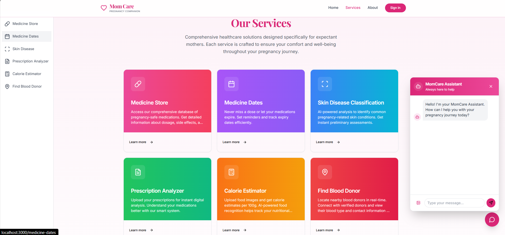
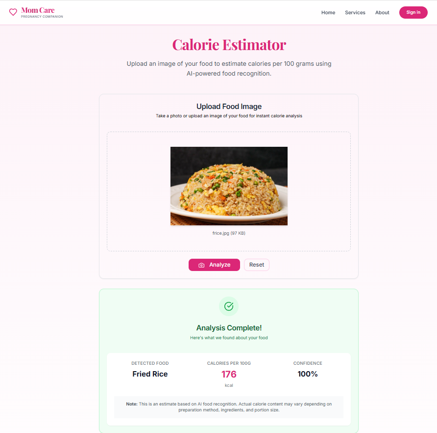
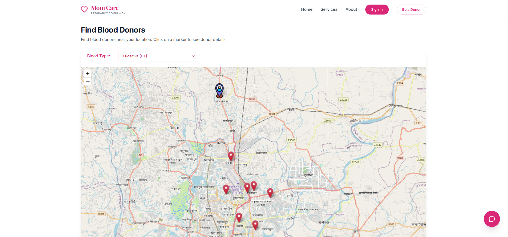
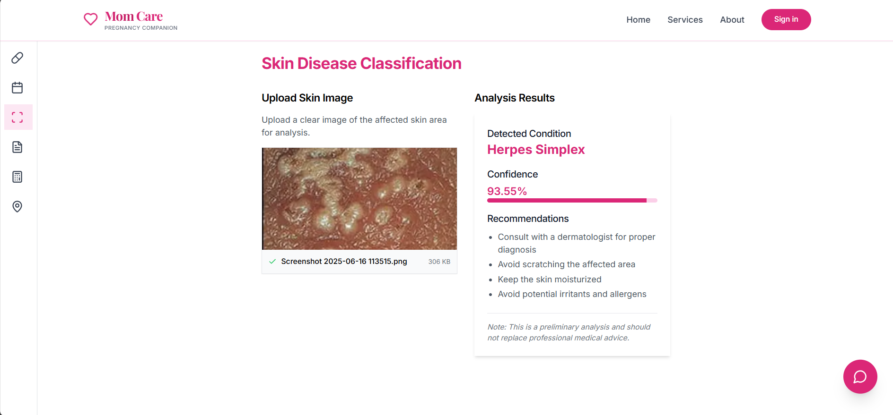

# MomCare - Maternal Healthcare App

<div align="center">
  <h3>📱 Application Screenshots</h3>
  
  <table>
    <tr>
      <td align="center">
        <strong>🏠 Home Page</strong><br/>
        
      </td>
    </tr>
    <tr>
      <td align="center">
        <strong>✨ Features Overview</strong><br/>
        
      </td>
    </tr>
    <tr>
      <td align="center">
        <strong>🍎 Calorie Estimator</strong><br/>
        
      </td>
    </tr>
    <tr>
      <td align="center">
        <strong>🩸 Blood Donor Finder</strong><br/>
        
      </td>
    </tr>
    <tr>
      <td align="center">
        <strong>🔬 Skin Disease Classification</strong><br/>
        
      </td>
    </tr>
    <tr>
      <td align="center">
        <strong>🔍 Image Search & Semantic Search</strong><br/>
        
      </td>
    </tr>
  </table>
</div>

A comprehensive Next.js application designed specifically for expectant mothers, providing essential healthcare services including medication tracking, prescription analysis, skin disease classification, blood donor location, and AI-powered calorie estimation.

## 🚀 Features

| Service | Description |
|---------|-------------|
| **🏥 Medicine Store** | Access pregnancy-safe medications database |
| **📅 Medicine Dates** | Track medication expiry dates and set reminders |
| **🔬 Skin Disease Classification** | AI-powered skin condition analysis |
| **📋 Prescription Analyzer** | Digital prescription analysis and management |
| **🍎 Calorie Estimator** | AI-powered food recognition and calorie estimation |
| **🩸 Find Blood Donor** | Interactive map for locating blood donors |

## 🛠️ Tech Stack

### Frontend
- **Next.js 15** - React framework with App Router
- **React 18** - UI library with hooks
- **TypeScript** - Type safety
- **Tailwind CSS** - Utility-first CSS framework
- **GSAP** - Animation library
- **Radix UI** - Accessible component primitives
- **Lucide React** - Icon library

### Backend Services
- **FastAPI** - Python web framework
- **Hugging Face Transformers** - AI model pipeline
- **Spoonacular API** - Nutrition data
- **PIL** - Image processing

## 📦 Installation

### Prerequisites
- Node.js 18+ and npm
- Python 3.8+
- pip (Python package manager)

### Quick Start
```bash
# 1. Clone the repository
git clone <repository-url>
cd momcare-latest

# 2. Install frontend dependencies
npm install

# 3. Setup Python microservices
cd momCareFoodAPI
python -m venv venv
source venv/bin/activate  # Windows: venv\Scripts\activate
pip install -r requirements.txt

cd ../momCareSkinAPI
python -m venv venv
source venv/bin/activate  # Windows: venv\Scripts\activate
pip install -r requirements.txt

# 4. Return to root and start the application
cd ..
npm run dev-all
```

## 🚀 Running the Application

### Option 1: Run Everything Together (Recommended)
```bash
npm run dev-all
```
Starts both Next.js frontend and Python microservices concurrently.

### Option 2: Run Separately

**Terminal 1 - Frontend:**
```bash
npm run dev
```

**Terminal 2 - Food API:**
```bash
npm run start-python
```

**Terminal 3 - Skin API (if needed):**
```bash
cd momCareSkinAPI
python main.py
```

## 🌐 API Endpoints

### Calorie Estimator
- **POST** `/api/calorie-estimate`
  - Upload food image as multipart/form-data
  - Returns: `{ "food": "Pizza", "calories_per_100g": 266, "confidence": 0.93 }`

### Python Microservices
- **Food API**: `http://localhost:8000/api/calorie-estimate`
- **Skin API**: `http://localhost:8001/api/skin-classification`

## 📱 Usage

### Calorie Estimator
1. Navigate to `/services/calorie-estimator`
2. Upload a food image using drag-and-drop or file selector
3. Click "Estimate Calories" to analyze
4. View results showing detected food, calories per 100g, and confidence

### Other Services
- Access via sidebar navigation or service cards
- Each service provides specialized pregnancy-related healthcare tools

## 🔧 Configuration

### Environment Variables
Create a `.env.local` file in the root directory:
```env
NEXT_PUBLIC_API_URL=http://localhost:3000
```

### API Keys
- **Spoonacular API**: `34827ffe67c644eabaa3459cefebfec6`
- **Hugging Face Model**: `nateraw/food-101` (automatic download)

## 🐛 Troubleshooting

### Common Issues

**Python Dependencies:**
```bash
pip install torch torchvision torchaudio --index-url https://download.pytorch.org/whl/cpu
```